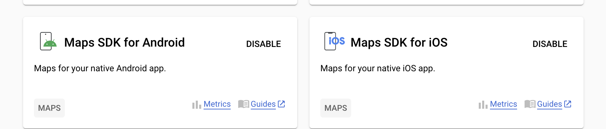

# fbs2

### flutterのインストール方法
#### Macの場合
1. Flutter 公式 HPの「Install」ページでmacOS を選択します
2. 「Get the Flutter SDK」 から zip ファイルをダウンロードし解凍します
3.  ユーザーフォルダ直下に「development」フォルダを作成し、ダウンロードした「flutter」フォルダを移動します
4. ターミナルを起動して vim .zshrc(vim ~/.zshrc)を実行(シェルがzshの場合)
5. export PATH="$PATH:[flutterフォルダが格納されているディレクトリ]/flutter/bin" を入力します。
6. シェルを再読み込みし、which flutterを実行した時、パスが表示されれば成功です。
#### Windowsの場合
1. Flutter 公式 HPの「Install」ページでwinOS を選択
2. 「Get the Flutter SDK」 から zip ファイルをダウンロードし解凍
3. C:\src\flutterなどに配置(Cドライブの任意のディレクトリなら大丈夫)
4. Windows => 設定 を開きます
5. 「env」で検索し、「環境変数を編集」を選択します
6.  「新規」 => 新しいユーザー変数 で変数名： FLUTTER_PATH,変数値： C:\src\flutter(3で配置したフォルダがC:\src\flutterの場合)を登録し、「OK」をクリックします
7. 「Path」を選択し、「編集」をクリック => 「新規」をクリック => 「%FLUTTER_PATH%\bin」を追加 => 「OK」をクリックして登録します
8. 「OK」をクリックして閉じます
9.  Windows + R で「cmd」を入力し、コマンドプロンプトを開きます
10. 「flutter doctor」コマンドを実行して、結果が出力されれば OK です


<br>

### ファイルの作成方法
1. ターミナルからコマンドを実行します

```console
$ flutter create helloworld
```

#####    (プロジェクト名 helloworldの作成方法)

<br>

### flutterの特徴
1. Flutterはプログラミング言語Dartのフレームワーク
2. FlutterのUIを構築しているパーツのことをWidgetと呼びます。
様々なWidgetを組み合わせることで複雑なUIを構築しているのです。
3. WidgetにはStatelessWidgetとStatefulWidgetの二つのWidgetがあります。
4. StatelessWidgetでは画面は再描画されません。
5. StatefullWidgetでは画面は再描画できます。
6. 画面の遷移にはpushとpop(スタック)を使います。
7. 新しい画面に遷移するにはpush,前の画面に戻るにはpopを使います。

<br>

#### flutter doctorについて
1. 「flutter doctor」コマンドを実行して[✓]が全てについていればokです。さらに一番下に
• No issues found!と表示されます。

```sh
Doctor summary (to see all details, run flutter doctor -v):
[✓] Flutter (Channel stable, 3.10.5, on macOS 13.4.1 22F82 darwin-arm64, locale ja-JP)
[✓] Android toolchain - develop for Android devices (Android SDK version 34.0.0)
[✓] Xcode - develop for iOS and macOS (Xcode 14.3.1)
[✓] Chrome - develop for the web
[✓] Android Studio (version 2022.2)
[✓] VS Code (version 1.79.2)
[✓] Connected device (3 available)
[✓] Network resources

• No issues found!
```

2. [×]がついている場所では、そのデバイスで環境が構築されていません。それぞれの環境構築方法は下の方を見てください

<br>

### Androidエミュレータの作成方法
1. Android Studio 公式 HPからダウンロードし、案内に従ってインストールする
2. Flutter、Dart のプラグインを導入するためPluginsに移動する。
3. Plugins でflutterと検索し、Flutter、Dart をインストールする(DartはFlutteをインストールすれば自動的にインスト ールされるはず)
4. welcome to android studioのページの右側にある３点リーダをクリックし、vertual device managerのページへいく。
5. create devicesで新しいデバイスが作れる。
### iosシュミレータの作成方法
1. Xcode をAppStoreからダウンロードします。
2. 最新機種のiosシュミレータはそのときできているはずです。
3. それ以外はiosシュミレータのwindowからdevice and sumilaterからデバイスを作れます。
### vscodeの設定
1. 拡張機能でflutterをインストール
2. エミュレータを起動するには右下に書いてあるデバイスの種類を変えます。
### firebaseの設定
1. https://firebase.google.com から始めます。
2. 右上の Go to console をクリックします。
3. 新規プロジェクトを作成ボタンを押してプロジェクト名などを入力します。
4. プロジェクトをローカルで起動します。
5. ターミナルからnpm install -g firebase-tools でCLIのインストールをしてfirebase loginを実行します
6. 作成したfultterプロジェクトのルートから、firebase initを実行してfirebaseの使いたい機能を選択します。
7. その他の設定は自分で決めてください。基本的に全てyesでいいと思います。
8. flutterfire configureを実行して、Flutter アプリを Firebase に接続するように構成します。
9. firebaseのサービスを使うにはapikeyなどが必要です。firebaseのサイトのautencation-sign-in methodのログインプロバイダのサービスを1つ以上有効にする。プロジェクトの設定- 全般に表示されます。
### firebase-hosting(flutter)
1. firebaseサイドナビの「開発 → Hosting」を選択
2. 「始める」を選択
3. firebase initを実行した時にHosting: Configure and deploy Firebase Hostingを選択します。
4. flutter build web --web-renderer htmlと実行してビルドします。(web版)
(その他はflutter run でok)
5. firebase deploy --only hostingを実行してwebで見れるよになります
### firebase-auth(flutter)
1. firebaseサイドナビの「開発 → Authentication」を選択
2. flutter プロジェクトのルートから、flutter pub add firebase_authを実行しプラグインをインストールします。
3. プラグインを コードにインポートします。
import 'package:firebase_auth/firebase_auth.dart';
4. ログイン認証のコードを書きます。
5. flutter run またはflutter buildで再ビルドします。
### google_sign_in(flutter)
1. googleアカウントでサインインするにはさらにgoogle_sign_inをインポートしてコードを書きます
2. Andorid版の場合SHA-1とSHA-256の値を取ってきてFirebaseコンソールの設定からプロジェクトのandroid版を選び、SHA証明書フィンガープリントでフィンガープリントを追加を選びまずSHA-1の値を貼り付けます。さらにSHA-256の値も貼り付けます。
(SHA-1,SHA-256の値の取り方:androidstudioの場合.プロジェクトを開いて、Android Studio-> Settings-> Expermentalから、Only include test tasks in the Gradle task list generated during Gradle Syncのチェックを外します。それからApplyを押して,android -> app -> build.gradleを開く。上の方にあるOpen for Editing in Android Studioをクリックする。右上のGradleをクリックするとメニューが展開されるので,app→Tasks→androidと辿っていくとsigningReportが確認されるのでそこを開いて、SHA-1,SHA-256の値をとる)
3. ios/Runner/info.plistにios/Runner/GoogleService-Info.plistのREVERSED_CLIENT_IDの値を挿入します。

```XML
<key>CFBundleURLTypes</key>
<array>
	<dict>
		<key>CFBundleTypeRole</key>
		<string>Editor</string>
		<key>CFBundleURLSchemes</key>
		<array>
			<!-- TODO Replace this value: -->
			<!-- Copied from GoogleService-Info.plist key REVERSED_CLIENT_ID -->
			<string>ここがREVERSED_CLIENT_IDを入れる場所です</string>
		</array>
	</dict>
</array>
```

<br>

### 各種エラーについて

```
Error output from CocoaPods: ↳ [!] Automatically assigning platform `iOS` with version `11.0` on target `Runner` because no platform was specified. Please specify a platform for this target in your Podfile. See `https://guides.cocoapods.org/syntax/podfile.html#platform`.
```

#### プロジェクトのルートから./ios/Podfile を一度消します。 

```
rm ios/Podfile
```

#### そして再ビルドします。

<br>

```
Error (Xcode): Building for iOS Simulator, but linking in object file built for iOS, file
```
1. プロジェクトのBuild SettingsのExcluded ArchitecturesのDebugとReleaseにAny iOS Simulator SDK arm64を追加することでarm64を除外します。
2. PodsのBuild SettingsのExcluded ArchitecturesのDebugとReleaseにもAny iOS Simulator SDK arm64を追加することでarm64を除外します。

<br>

```
ERROR:flutter/lib/ui/ui_dart_state.cc(209)] Unhandled Exception: [core/duplicate-app] A Firebase App named "[DEFAULT]" already exists
```
flutter cleanとflutter pub getをターミナルで実行することで解決すると思います。
それでも解決しない場合は、

1. Firebase.initializeApp()を呼び出す：このエラーは、Firebaseを使用する前にFirebaseを初期化していない場合に発生することがあります。Firebase.initializeApp()を呼び出してFirebaseを初期化する必要があります。
2. Firebase Appの重複を避ける：もう一つのFirebase Appが既に存在している場合、名前が重複してしまう可能性があります。
 Firebase.initializeApp()を呼び出す前に、既存のFirebase Appを確認し、重複している場合は適切に処理する必要があります。
3. インターネット接続を確認する：一部のエラーレポートでは、インターネット接4続の問題がこのエラーの原因であることが示されています。
4. プラグインの不足を確認する：一部のエラーレポートでは、MissingPluginExceptionが原因であることが示されています。必要なプラグインが正しくインストールされていることを確認してください。


<br>

### p-list(環境設定変数)の読みエラーについて、

#### API_KEYが間違っている可能性があります。fire_authの場合、firebase_optionns.dartにまとめられているので、そこのファイルからコピー＆ペーストすること。(firebase_optionns.dartの中身を変えないこと)
#### google_maps_flutterの場合、Google Cloud Platformでapi_keyをenableにしてください。



<br>

ios/Runner/GoogleService-Info.plistについて
```
Unhandled Exception: [core/duplicate-app] A Firebase App named "[DEFAULT]" already exists
```
lib/firebase_options.dart
とios/Runner/GoogleService-Info.plist
の間で情報の不整合があった時、
GoogleService-Info.plistを削除した上で、Flutterfire Configureコマンドを改めて実行します。


<br>

```
Error launching application on sdk gphone64 arm64.
```
エミュレーターのメモリ(RAM)を増量すればビルドできる。
Android Studioの
管理画面 ＞ 三点リーダー ＞ Virtual Device Manager
右のペンのアイコンをクリックすると
Edit画面内にShow Advanced Settingsがあるので選択。
詳細設定画をスクロールして下の画面に行くとRAMの設定箇所が表示される。


<br>

### google_maps_flutterについての環境構築

Android用の設定
android/app/src/main/AndroidManifest.xmlに以下を追記する
```XML
        android:label="fbs2"
        android:name="${applicationName}"
        android:icon="@mipmap/ic_launcher">
        <!--android:name="io.flutter.embedding.android.geo.API_KEY"-->
        <meta-data                                              //追加
            android:name="com.google.android.geo.API_KEY"       //追加
            android:value="取得したAPIキー"/>                     //追加
        <activity
            android:name=".MainActivity"
            ‥
 ```

SDKバージョンの設定
google_maps_flutterを使うには、最低でも20以上のSDKバージョンが必要です。
android/app/build.gradleのminSdkVersionを20以上に変更しましょう。

 ```Java
android {
    defaultConfig {
        minSdkVersion 20
    }
}
 ``` 

iOS用の設定
ios/Runner/Info.plistを開いて以下を追記します
AppDelegate.swiftに以下を追加します。

```objectivec
import UIKit
import Flutter
import GoogleMaps  //追加

@UIApplicationMain
@objc class AppDelegate: FlutterAppDelegate {
  override func application(
    _ application: UIApplication,
    didFinishLaunchingWithOptions launchOptions: [UIApplication.LaunchOptionsKey: Any]?
  ) -> Bool {
    GMSServices.provideAPIKey("取得したAPIキー")                     //追加
    GMSServ ices.setMetalRendererEnabled(true)// これを入れるかどうかは自由 Appleのハードウェアに最適化。
    GeneratedPluginRegistrant.register(with: self)
    return super.application(application, didFinishLaunchingWithOptions: launchOptions)
  }
}
```

<br>

#### 緯度経度の数値が実際の緯度経度と少しずれています。原因は以下の通り
#### Google Map → 日本版　　//普通はこれ
#### Google Map API → 世界版　//gogole_maps_fltterで使っているのはこれ
#### 解決法
#### Geo Coidingで調べる
#### 簡易的なら、計算で修正できる。


### githubに上げる
#### .envは読みにくくするだけで　APIkeyなどを秘匿しないので非推奨
#### .gitignoreを使って秘匿する。
#### iOSの場合
1. 環境変数用ファイルを作成
- Xcode から環境変数用ファイルをRunnerフォルダ内に作成します。
- Xcode を開いて、Runner フォルダを選択した状態で「New File...」を選択します。
- 「Swift File」を選択し、
- ファイル名を「Environment.swift」として作成
- 最後に作成した Environment.swift に以下の通り、追記して完成です。<APIキー>となっている箇所にはご自身の API キーを記載してください。
```
import Foundation

 struct Env {
  static let googleMapApiKey = "<APIキー>"
}
```
2. AppDelegate を変更
- 次に AppDelegate.swift を以下の通り、変更します。

今までご自身の API キーを記載していた箇所をEnv.googleMapApiKeyに差し替えます。この記述により先ほど作成した環境変数用のファイルから値を取得する様に変更されます。
```
import UIKit
import Flutter
import GoogleMaps

@UIApplicationMain
@objc class AppDelegate: FlutterAppDelegate {
 override func application(
   _ application: UIApplication,
   didFinishLaunchingWithOptions launchOptions: [UIApplication.LaunchOptionsKey: Any]?
 ) -> Bool {
    GMSServices.provideAPIKey(Env.googleMapApiKey)
   GeneratedPluginRegistrant.register(with: self)
   return super.application(application, didFinishLaunchingWithOptions: launchOptions)
 }
}
```

3. .gitignoreに追加
- 最後にiosディレクトリ内の.gitignoreに作成した環境変数用ファイルを追加しましょう。
```
Environment.swift
```

#### Androidの場合
1. 環境変数用ファイルを作成
- androidディレクトリにsecret.propertiesという名前のファイルを追加し、その中に API キーを記述します。<APIキー>となっている箇所はご自身の API キーを記入してください。
```
googleMap.apiKey=<APIキー>
``` 
2. app/build.gradleを変更
- 起動時に環境変数を読み込む様にapp/build.gradleに変更を加えます。
```
 def secretProperties = new Properties()
 def secretPropertiesFile = rootProject.file('secret.properties')
 if (secretPropertiesFile.exists()) {
    secretPropertiesFile.withReader('UTF-8') { reader ->
        secretProperties.load(reader)
    }
 }

android{
   ...
  defaultConfig{
        ...
       manifestPlaceholders += [
           googleMapApiKey: secretProperties.getProperty('googleMap.apiKey'),
       ]
       ...
  }
}

```

3. AndroidManifest.xmlを変更
- AndroidManifest.xmlで API キーを記載していたところを${googleMapApiKey}に差し替えます
```
  <application
       android:label="almost_zenly"
       android:name="${applicationName}"
       android:icon="@mipmap/ic_launcher">
        <meta-data android:name="com.google.android.geo.API_KEY" android:value="${googleMapApiKey}"/>
       <activity
```
4. .gitignoreに追加
最後にandroidディレクトリ内の.gitignoreに作成した環境変数用ファイルを追加しましょう。
```
secret.properties
```
####  最後にコードをアップロードする際に、ちゃんとEnvironment.swift、secret.propertiesが ignore されていることを確認してください。

### pre-commitの導入方法
#### https://pre-commit.com/#install を参照して

### githubに上げる方法
1. GitHubアカウントを作成します。
2. GitHub上でリポジトリを作成します。
3. ローカル環境でGitをインストールします。
- https://git-for-windows.github.io/でインストール
- 
4. (ローカル環境でFlutterのプロジェクトを作成します。)
5. Gitを使って、Flutterのプロジェクトをローカルリポジトリに追加します。
6. ローカルリポジトリにコミットします。
7. ローカルリポジトリをリモートリポジトリにプッシュします。